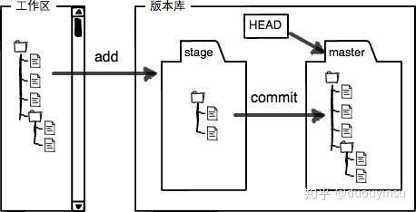
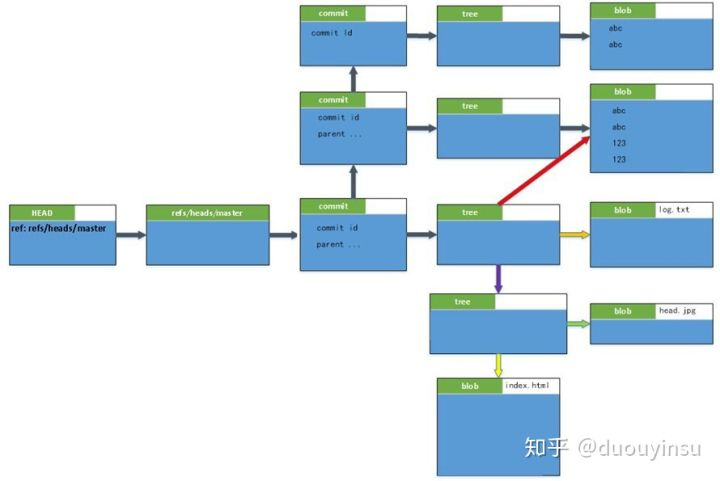

# Git 概念

# Git文件状态

仓库中的文件可能存在于这三种状态：

- Untracked files → 文件未被跟踪；
- Changes to be committed → 文件已暂存，这是下次提交的内容；
- Changes not staged for commit → 已跟踪文件的内容发生了变化，但还没有放到暂存区。

通过git add的文件会加入暂存区，之后git commit会将暂存区的所有文件提交更新。 

# Git对象和目录

在Git系统中，每个Git对象都通过哈希值来代表这个对象。哈希值是通过SHA1算法计算出来的，长度为40个字符（40-digit）。

commit, tree, blob, tag四种object

所有的内容都是环环相扣的，我们通过HEAD找到一个当前分支，然后通过当前分支的引用找到最新的commit，然后通过commit可以找到整个对象关系模型： 

参考 https://zhuanlan.zhihu.com/p/44741777

.git目录

